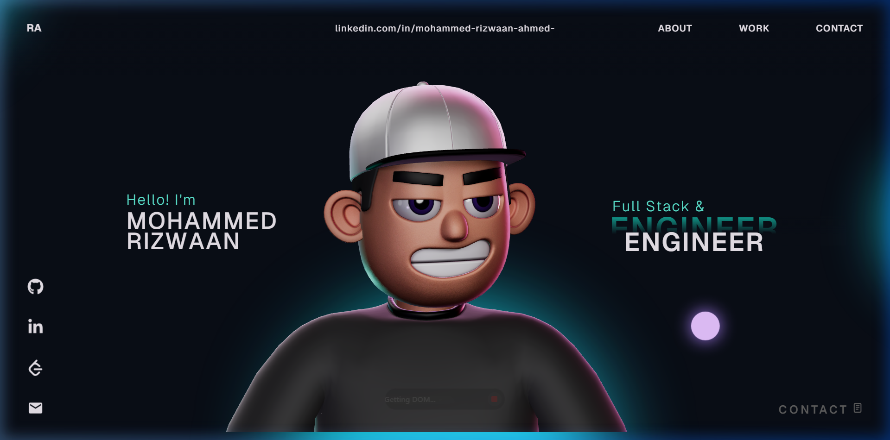
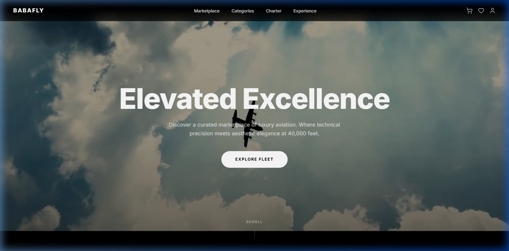
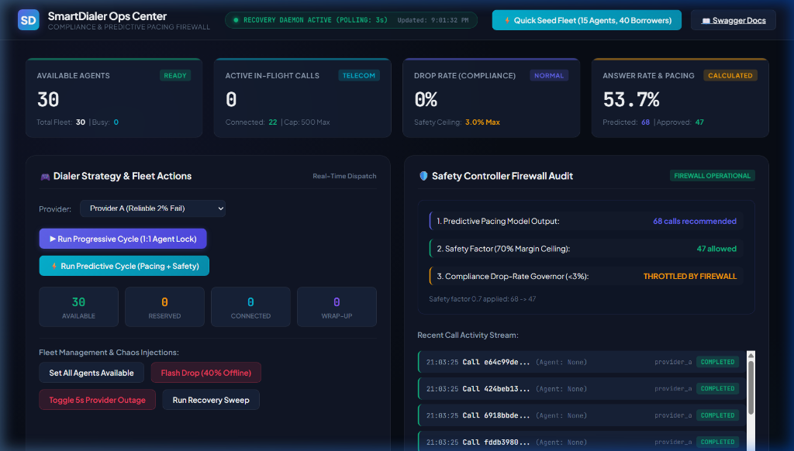
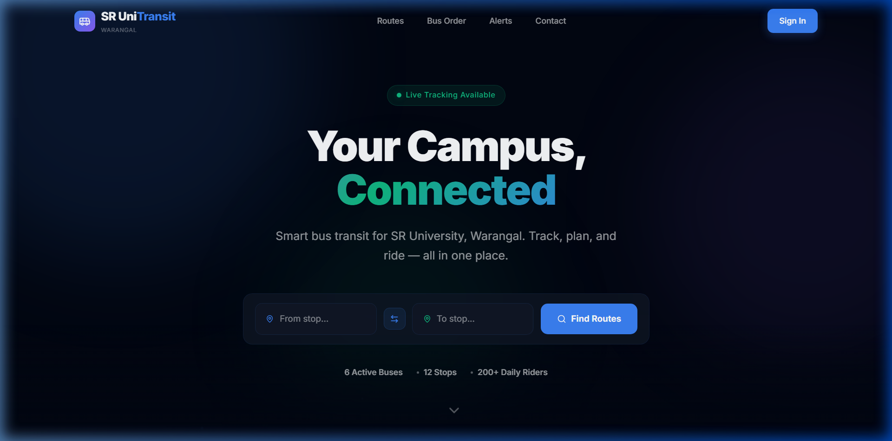
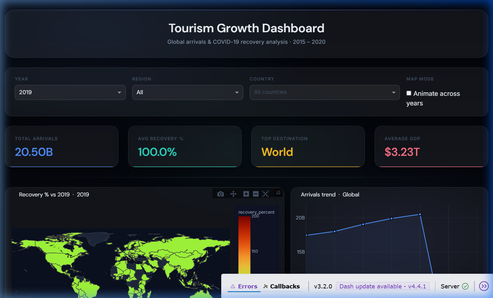

<div align="center">


# Mohammed Rizwaan Ahmed — 3D Interactive Portfolio

<p align="center">
  <strong>A game-engine-grade 3D developer portfolio powered by React 18, Three.js, Rapier Physics & GSAP.</strong><br/>
  <em>Interactive WebGL simulations · Cinematic scroll · Physics-driven micro-animations</em>
</p>

<p align="center">
  <a href="https://github.com/Rizwaan-06/3d-Portfolio-/stargazers"></a>
  <a href="https://github.com/Rizwaan-06/3d-Portfolio-/network/members"></a>
  <a href="https://github.com/Rizwaan-06/3d-Portfolio-/blob/main/LICENSE"></a>
  
  
  
</p>

<p align="center">
  <a href="#-live-preview">Preview</a> •
  <a href="#-features">Features</a> •
  <a href="#-tech-stack">Tech Stack</a> •
  <a href="#-screenshots">Screenshots</a> •
  <a href="#-featured-projects">Projects</a> •
  <a href="#-getting-started">Get Started</a> •
  <a href="#-project-structure">Structure</a> •
  <a href="#-customization-guide">Customize</a> •
  <a href="#-contact--profiles">Contact</a>
</p>

<br/>



</div>

---

## Overview

Welcome to the official repository of **Mohammed Rizwaan Ahmed's 3D Interactive Portfolio**. 

Architected with contemporary frontend technologies including **React 18**, **TypeScript**, **Three.js**, **React Three Fiber (R3F)**, **Rapier Physics**, and **GSAP (GreenSock)**, this portfolio delivers an interactive, game-engine-grade storytelling experience that highlights full-stack web engineering, cloud infrastructure capabilities, and algorithmic problem-solving.

### Key Differentiators
- **Hardware-Accelerated 3D Simulation**: Real-time rigid-body collisions and gravity physics for dynamic tech badges.
- **Cinematic Motion Design**: Smooth inertia-based scrolling (`ScrollSmoother`) coupled with complex pinned scroll triggers.
- **Micro-Interactions**: Magnetic physics-driven cursor, custom hover interactions, and responsive motion feedback.
- **Production Performance**: 60+ FPS rendering, Draco 3D mesh compression, and optimized bundle splitting via Vite.

---

## ✨ Features

<table>
<tr>
<td width="50%">

### 🎮 3D Physics Simulation
Real-time rigid-body collision engine using **@react-three/rapier**. Tech stack icons float, bounce, and react to your pointer with gravity and impulse forces — like a game engine inside your browser.

</td>
<td width="50%">

### 🎬 Cinematic Scroll Experience
Powered by **GSAP ScrollSmoother** and **ScrollTrigger** — inertia-based momentum scrolling with pinned sections, split-text reveals, and timeline-driven animations on every scroll event.

</td>
</tr>
<tr>
<td width="50%">

### 🧍 Rigged 3D Character
A fully animated, Draco-compressed **GLTF avatar** that tracks your cursor in real-time. Enhanced with N8AO ambient occlusion post-processing for studio-quality lighting.

</td>
<td width="50%">

### 🖱️ Physics Cursor
A magnetic, physics-backed **custom cursor** that morphs on hover interactions, blending with the ambient WebGL environment for a truly immersive UI.

</td>
</tr>
<tr>
<td width="50%">

### 🎠 Project Showcase Carousel
An interactive slide-show of production applications with live demo links, technology badges, and architectural notes — designed for rapid scanning.

</td>
<td width="50%">

### ⚡ 60+ FPS Performance
**Vite 5** bundler with HMR, **Draco 3D mesh compression**, worker-thread decoding, lazy-loaded Three.js assets, and delta-capped physics for silky smooth rendering.

</td>
</tr>
</table>

---

## 🛠️ Tech Stack

<div align="center">

| Domain | Technologies & Libraries |
|:---|:---|
| **Core Architecture** |      |
| **3D & WebGL Engine** |     |
| **Physics & Post-Processing** |    |
| **Motion & Animation** |    |
| **UI Components & Icons** |    |
| **Code Quality & Tooling** |    |

</div>

---

## 📸 Screenshots

<div align="center">

### 🏠 Hero — 3D Character Landing Section


<br/><br/>

### ✈️ Project — BabaFly Aircraft Charter Platform


<br/><br/>

### 🧠 Project — Smart Dialer ML Dashboard


<br/><br/>

### 🚌 Project — SR UniTransit Campus Bus System


<br/><br/>

### 🌍 Project — Tourism Storytelling Dashboard


</div>

---

## 🗂️ Featured Projects

Key engineering projects showcased in the interactive carousel:

| # | Project | Description | Core Stack | Link |
|:---:|:---|:---|:---|:---:|
| 01 | **BabaFly** | Modern aircraft charter & marketplace with JWT-authenticated booking pipelines and instant inventory filtering. | `React` `Node.js` `Express` `MongoDB` `Tailwind` `JWT` | [🔗 Live](https://baba-fly.vercel.app/) |
| 02 | **SR UniTransit** | Intelligent campus bus transit system with real-time schedule tracking, route dispatching, and admin portals. | `React` `Node.js` `Express` `MongoDB` `REST API` | [📁 Repo](https://github.com/Rizwaan-06/University-Bus-Transport-) |
| 03 | **Smart Dialer ML** | ML-augmented telecom mission control dashboard optimizing predictive pacing and compliance metrics. | `Python` `FastAPI` `Scikit-Learn` `Predictive Pacing` | [📁 Repo](https://github.com/Rizwaan-06/smart-dialer-ML-) |
| 04 | **Tourism Dashboard** | Data analytics platform visualizing global travel patterns and post-pandemic recovery indices. | `Python` `Plotly Dash` `Pandas` `Bootstrap` | [📁 Repo](https://github.com/Rizwaan-06/Tourism-Growth-and-Storytelling-Dashboard) |

---

## 🚀 Getting Started

### Prerequisites

Ensure you have the following installed:

- [Node.js](https://nodejs.org/) — version **18.0.0** or higher
- [npm](https://www.npmjs.com/) **v9+** (or [pnpm](https://pnpm.io/) / [yarn](https://yarnpkg.com/))
- [Git](https://git-scm.com/)

### Installation & Run

```bash
# 1. Clone the repository
git clone https://github.com/Rizwaan-06/3d-Portfolio-.git
cd 3d-Portfolio-

# 2. Install all dependencies
npm install

# 3. Launch the development server
npm run dev
```

Then open your browser at:

```
Local:   http://localhost:5173/
Network: http://<your-ip>:5173/
```

### Available Scripts

| Command | Description |
|:---|:---|
| `npm run dev` | Launches Vite dev server with Hot Module Replacement (HMR) |
| `npm run build` | Type-checks with TypeScript then builds optimized `dist/` bundle |
| `npm run preview` | Serves the production `dist/` bundle locally for auditing |
| `npm run lint` | Runs ESLint across all source files for code quality checks |

---

## 📁 Project Structure

```
3d-Portfolio-/
├── public/
│   ├── draco/              # Draco decoder WASM binaries (worker-thread mesh decompression)
│   ├── images/             # Project screenshots, tech icons (.webp), and preview assets
│   ├── models/             # GLTF/GLB 3D character and environment models
│   ├── favicon.svg         # Branded SVG favicon
│   └── hero.mp4            # Ambient video background for the hero section
│
├── src/
│   ├── assets/             # Vector SVGs and static icon assets
│   ├── components/
│   │   ├── Character/      # 3D canvas setup, OrbitControls, and character rendering
│   │   ├── styles/         # Scoped CSS modules for each section
│   │   ├── utils/          # GSAP animation builders and custom easing helpers
│   │   ├── About.tsx       # Professional biography & engineering overview
│   │   ├── Career.tsx      # Interactive career timeline & milestones
│   │   ├── Contact.tsx     # Social links, credentials, and contact form
│   │   ├── Cursor.tsx      # Physics-backed magnetic cursor with hover modes
│   │   ├── Landing.tsx     # Hero section with 3D canvas + GSAP text animations
│   │   ├── Loading.tsx     # Animated loading screen with progress feedback
│   │   ├── MainContainer.tsx   # Master layout and section orchestration
│   │   ├── Navbar.tsx      # Sticky nav with GSAP smooth-scroll anchors
│   │   ├── SocialIcons.tsx # Floating social media icon strip
│   │   ├── TechStack.tsx   # 3D Rapier rigid-body physics ball pit
│   │   ├── WhatIDo.tsx     # Skill domains & technical capability breakdown
│   │   ├── Work.tsx        # Interactive project showcase carousel
│   │   └── WorkImage.tsx   # Individual project preview card component
│   ├── context/            # Global React context & application state
│   ├── data/               # Content models, project records, and link configs
│   ├── types/              # TypeScript interfaces and type declaration files
│   ├── App.tsx             # Root application component
│   ├── index.css           # Global CSS resets and design tokens
│   └── main.tsx            # React DOM entry point
│
├── eslint.config.js        # ESLint flat config with TypeScript rules
├── vite.config.ts          # Vite plugins and dev server configuration
├── tsconfig.json           # TypeScript project references
└── package.json            # Dependencies, scripts, and package metadata
```

---

## 🎨 Customization Guide

Fork and adapt this portfolio in a few steps:

### 1 · Personal Identity & Biography
Update name, titles, and greeting in [`src/components/Landing.tsx`](src/components/Landing.tsx) and your professional bio in [`src/components/About.tsx`](src/components/About.tsx).

### 2 · Career & Experience
Edit internship entries, education milestones, and timeline cards in [`src/components/Career.tsx`](src/components/Career.tsx).

### 3 · Project Showcase
Update the `projects` array in [`src/components/Work.tsx`](src/components/Work.tsx) with your project title, description, URL, and screenshot path. Drop new previews into `public/images/`.

### 4 · Tech Stack Physics Balls
Add icons to `public/images/` and update `imageUrls` in [`src/components/TechStack.tsx`](src/components/TechStack.tsx). Adjust `restitution`, `gravity`, and ball `count` for different physics behavior.

### 5 · 3D Character Model
Replace the GLB file in `public/models/` and update the path in the `Character/` component. Ensure the model is Draco-compressed for optimal load performance.

### 6 · Social Links & Contact
Update LinkedIn, GitHub, LeetCode, and email in [`src/components/Contact.tsx`](src/components/Contact.tsx) and [`src/components/Navbar.tsx`](src/components/Navbar.tsx).

---

## ⚙️ Performance & Architecture Notes

- **Draco Mesh Compression** — GLTF/GLB models are decompressed on worker threads via `public/draco/` WASM binaries, keeping the main UI thread unblocked during load.
- **Physics Step Capping** — Frame deltas in `TechStack.tsx` are bounded with `Math.min(0.1, delta)` to prevent physics instability when browser tabs are inactive.
- **GSAP Memory Safety** — All `ScrollTrigger` and `ScrollSmoother` instances are killed on component unmount to prevent memory leaks during navigation.
- **Vite Code Splitting** — Dynamic imports and lazy-loaded Three.js scene chunks minimize the initial JavaScript payload.
- **SEO & Open Graph** — Structured metadata, Open Graph tags, and `<link rel="preload">` directives configured in `index.html`.
- **Vercel Analytics** — Lightweight, privacy-first page view analytics via `@vercel/analytics`.

---

## 📬 Contact & Profiles

<div align="center">

**Mohammed Rizwaan Ahmed**
*Full Stack Developer · MERN Architect · Cloud & AI/ML Enthusiast*
*B.Tech in Computer Science & Engineering — SR University, Warangal*

<br/>

[](https://www.linkedin.com/in/mohammed-rizwaan-ahmed-/)
[](https://github.com/Rizwaan-06)
[](https://leetcode.com/u/Rizwaan_Ahmed_20/)
[](mailto:rizwaanahmed2006@gmail.com)

</div>

---

## 📄 License

This project is open source and available under the [MIT License](LICENSE).

<div align="center">
  <sub>Designed and developed by <a href="https://github.com/Rizwaan-06">Mohammed Rizwaan Ahmed</a>.</sub>
</div>
